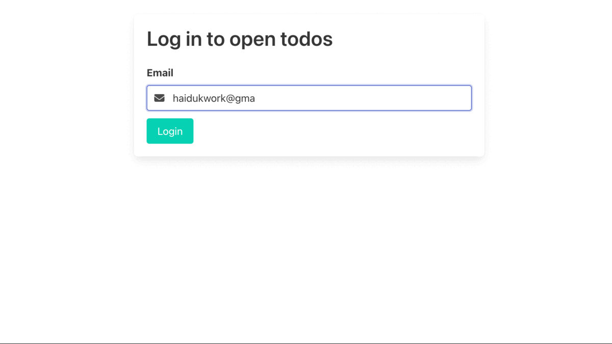

# 📋 TODO APP

## Table of contents

- [Overview](#overview)
  - [The challenge](#the-challenge)
  - [Screenshot](#screenshot)
  - [Links](#links)
- [My process](#my-process)
  - [Built with](#built-with)
  - [What I learned](#what-i-learned)
- [Author](#author)

## Overview

### The challenge

Users should be able to:

- Sign In or Log In
- Create, Delete and Update the status of TODO or rename it
- Filter by All, Active and Complited
- Delete all TODOs
- Toggle status of all TODOs

### Screenshot

### Links

- [Solution URL](https://github.com/superpooperxxx/TODO-app)
- [Live Site URL](https://superpooperxxx.github.io/TODO-app/)

## My process

### Built with

- REST api
- TypeScript
- React
- Bulma

### What I learned

- The main focus was to learn how to work with API applying GET, POST, DELETE and PATCH methods
- Also practiced with TypeScript

## Author

- Github - [superpooperxx](https://github.com/superpooperxxx)
- LinkedIn - [Kyrylo Haiduk](https://www.linkedin.com/in/kyrylo-haiduk/)
- Telegram - [@haidukwork](https://t.me/haidukwork)
- Frontend Mentor - [@superpooperxxx](https://www.frontendmentor.io/profile/superpooperxxx)
